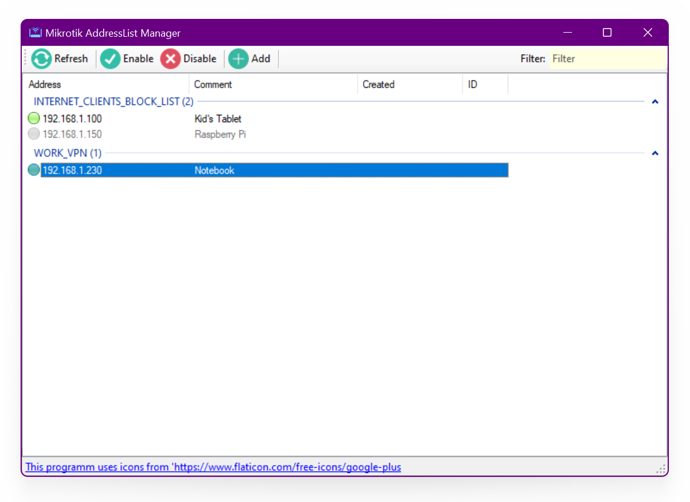

# On Start
When programm starts, you will see Master Password window:

Here you specify your own encryption key, which will be used to encrypt the routers credentials (Addressbook).

**It is strongly recommended that you set your own password to prevent sensitive data from being leaked**. With a blank password, the Addressbook is encrypted with a default encryption key and can be easily read on another PC.

**If you forget your password, you will not be able to restore your address book!** The program does not store your Master Password anywhere.

# Address Book
**Note: This address book has nothing to do with the Mikrotik WinBox AddressBook.**

After entering the master password, you will be taken to the AddressBook - where you need to select the device to which we will connect:

You can add or remove devices in AddressBook, and change credentials.
If necessary, you can place this AddressBook from the roaming profile to any cloud storage for synchronization via [Symlinks](https://learn.microsoft.com/en-us/windows-server/administration/windows-commands/mklink).
The roaming profile folder where program data is stored is:
`[user_profile]\AppData\Roaming\UOM\Mikrotik AddressList Manager\`

# Manage Selected Device AddressList

Thats All Folks!

 