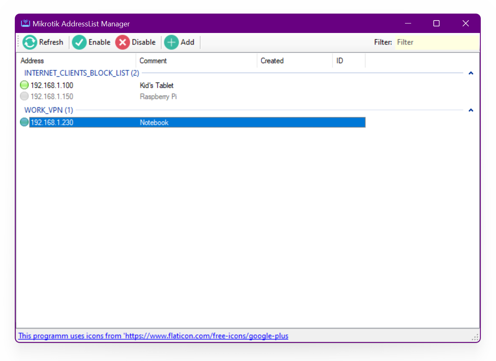

# Mikrotik AddressList Manager for Windows(R) desktop and Android (is in progress...)
This tool will be useful for those SOHO admins who manage their Mikrotik's via Firewall Address Lists.

## Briefly
MIkrotik AddressList Manager connects to the Mikrotik device and gets a list of Firewall AddressList's from it, allowing you to enable and disable individual elements (only static).

If, for example, you have an AddressList 'INTERNET_CLIENTS_BLOCK_LIST' with list of hosts from LAN who are allowed access to the Internet (and you have a firewall rule configured accordingly for the corresponding list), then by enabling / disabling elements of this list through this program you will allow or block access to the corresponding resources for the specified hosts:

[How To Use](Docs/Help.md)

## Security And Sensitive Data
To connect to the device, you need to allow Mikrotik-API connections on device. You can specify the connection port manually, or use the standard one.

The program stores a list of Mikrotik devices and their credentials (AddressBook) in a roaming part of the user profile. This data is encrypted by a user- provided Master Password.

In unencrypted form are stored the last selected device address and the collapsed / expanded statuses of the AddressList groups of the main window.

## Dumb User Protection
For some protection against user error, the program does not allow deleting elements of Mikrotik AddressLists, but only turning them on / off. You can also add new items to the address list (they are added in disabled state for safety).

## Third party copyright
This tool uses icons from [flaticon.com](https://www.flaticon.com/free-icons/google-plus).

Mikrotik-API is supported by [MikrotikDotNet](https://github.com/janmohammadi/MikrotikDotNet).

When using or distributing this content, you must comply with the requirements of the copyright holder.

## Denial of responsibility
Everything you use includes risks of occurrence and all possible consequences and potential losses that occur at your own risk. The author does not recommend using any parts of this code for any kind of responsible applications. Use only at your own risk.